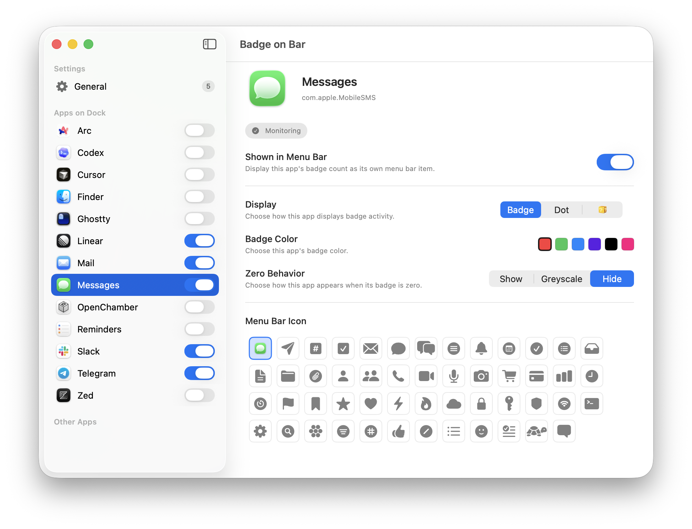

# Badge On Bar

Badge On Bar is a native macOS menu bar app that mirrors Dock badge counts into the menu bar.

  

Badge On Bar is a rewrite of the fantastic [Doll](https://github.com/xiaogdgenuine/Doll) project.

## Contributing

Issues and PRs welcome.

Tools:

- `mise test` — run the complete app, web, deployment, and shared-gem test suite
- `mise simulate macos` — build and launch the macOS app
- `mise xcode` — open the Xcode project
- `$publish` — version, test, push, sign, notarize, and publish to Codeberg and GitHub Releases

## License

MIT
